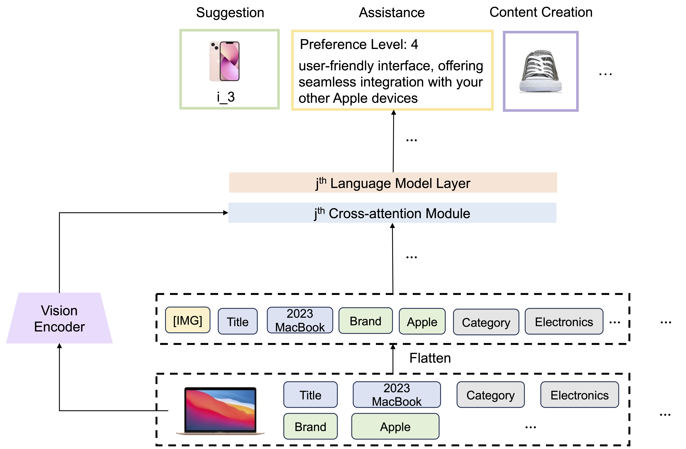

# UniMP
This is the repo for our **ICLR 2024** Paper based on Pytorch.

[Towards Unified Multi-Modal Personalization: Large Vision-Language Models for Generative Recommendation and Beyond](https://openreview.net/forum?id=khAE1sTMdX)

by Tianxin Wei, Bowen Jin, Ruirui Li, Hansi Zeng, Zhengyang Wang, Jianhui Sun, Qingyu Yin, Hanqing Lu, Suhang Wang, Jingrui He, Xianfeng Tang

# Overview
UniMP is a unified multi-modal generative personalization framework that leverages diverse modalities of raw user data to deliver tailored experiences across recommendation, search, preference prediction, explanation generation, and beyond.



# Setup

Key environments include:

```python
torch==2.0.1
open-flamingo==2.0.1
accelerate>=0.19.0
deepspeed
```

The dependencies can be installed via:

```python
pip install -r requirements.txt
```

# Data Creation & Processing

Our task data is created and collected from the [Amazon Review 2014](https://cseweb.ucsd.edu/~jmcauley/datasets/amazon/links.html) (and 2018) datasets. We provide the preprocessing and download script in the `data` folder. You can choose to extract user information from a single domain or multiple domains by specifying the `data_names`. 

We also provide the scripts (`data/data_preprocess_hm.py` and `data/data_preprocess_netflix.py`) for the  official multi-modal [H&M](https://www.kaggle.com/competitions/h-and-m-personalized-fashion-recommendations/data) dataset and Netflix dataset provided by [LLMRec](https://github.com/HKUDS/LLMRec).

The example processing step for the Amazon dataset can be done as follows:

```python
cd data/
python data_preprocess_multimodal_full.py
```

There may exist some broken/expired images on the Internet, so sometimes we may need to filter out the noisy images via, for example, `filter_img_noise.py`.

To generate the training and evaluation data for item selection and explanation generation tasks, we provide `gen_img_sel.py` and `keep_exp.py` for reference.

To make transformers generate images, please refer to [VQGAN](https://github.com/CompVis/taming-transformers) and its scripts. The basic process is first encoding the item image into a sequence of tokens via the VQGAN encoder, then optimizing the model to generate the sequence of tokens by inputting historical tokens (images) and related information, and lastly feeding the generated tokens into the VQGAN decoder to obtain the image.

# Training

We provided several example scripts for reference. `unimp_task.sh` denotes the training script for a single task, while `unimp_all_tasks.sh` is the script for multiple tasks. `finetune` denotes the fine-tuning after multi-task training. `hm` and `netflix` denote the H&M and Netflix multi-modal datasets. For instance, one can run:

```python
cd UniMP
./unimp_task.sh 2e-4 3 4b-instruct all rec 2 2
./unimp_all_tasks.sh 2e-4 3 4b-instruct all 2 2
```

In the script, `task` denotes the training task (e.g., rec), `mmrec_path` denotes the dataset folder, `single_task` denotes if the model is optimized using a single task or multiple tasks, and `gamma` is the hyper-parameter in the focal loss term.

The backbone model is mainly adopted from `openflamingo.Flamingo`, which may consume much GPU memory. Based on different used datasets, you may need to revise the name of the additional tokens (e.g., item_tokens) in the main file. More details can be found in the code.

For inference, we perform inference every epoch. One can also refer to `unimp_eval.sh` or `unimp_task_finetune_eval.sh`. Please make sure that the `load_weights_name` and `run_name` match the model. For example, one can run:

```python
./mmrec_eval.sh 2e-4 3 4b-instruct all rec 1 2 2
```
# Acknowledgment

Our code refers to [OpenFlamingo](https://github.com/mlfoundations/open_flamingo) and [Otter](https://github.com/Luodian/Otter). Huge thanks to [OpenFlamingo](https://github.com/mlfoundations/open_flamingo) and [Otter](https://github.com/Luodian/Otter) team for their great work.

# Citation
If you find our UniMP paper, code or data useful, please kindly cite:
```
@article{wei2024towards,
  title={Towards unified multi-modal personalization: Large vision-language models for generative recommendation and beyond},
  author={Wei, Tianxin and Jin, Bowen and Li, Ruirui and Zeng, Hansi and Wang, Zhengyang and Sun, Jianhui and Yin, Qingyu and Lu, Hanqing and Wang, Suhang and He, Jingrui and others},
  journal={arXiv preprint arXiv:2403.10667},
  year={2024}
}
```


